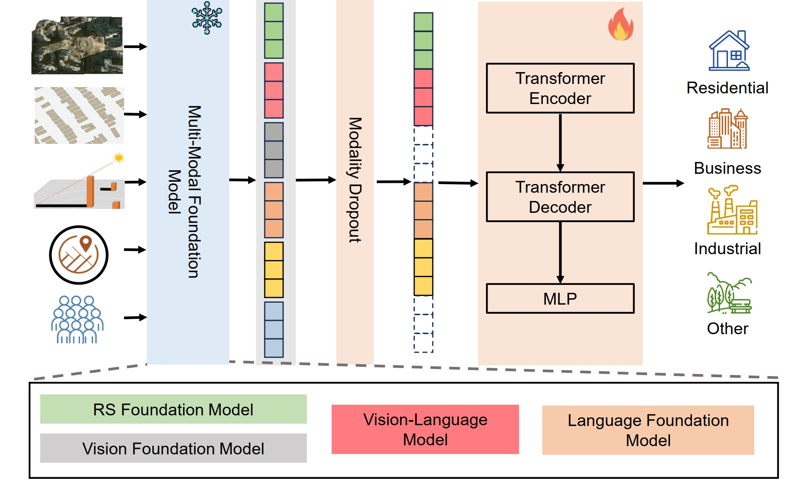

# M3LUC
The codes of the Sigspatial24' paper M3LUC: Multi-modal Model for Urban Land-Use Classification.


## Usage: 
### Data Preparation
We need multiple data sources to train the model. The data sources include:
- POI data (Json file)
- Remote Sensing Image (City_id.png)
- Building footprints (City_id_building.png)
- Building height (City_id_height.png)
  
Please refer to the folder **datasets/source** for more details.

### Generate the embedding of VLM
Run **cli_demo_2.py** to generate the $E_{vlm}$. We conduct a simple Q/A process and ask it to map the land-usage. A few examples are shown in the folder **datasets/res_Cog2**.

### Generate embedding and train the model
Run **train.py** and the following will be done
1. Generate embedding of all other foundation models, inlcuding POI, RS image and all other inputs. The embeddings will be stored into "--cache-dir".
2. Use the cached embedding in step 1, and the VLM embedding in previous section to train the classifier. 
3. The validation result, and the model weight will be stored into "--output_dir".

## Citation
If you find this code useful, please cite the following paper:
```bibtex
@inproceedings{li2024m3,
  title={M3 LUC: Multi-modal Model for Urban Land-Use Classification},
  author={Li, Sibo and Zhang, Xin and Lin, Yuming and Li, Yong},
  booktitle={Proceedings of the 32nd ACM International Conference on Advances in Geographic Information Systems},
  pages={270--281},
  year={2024}
}
```
